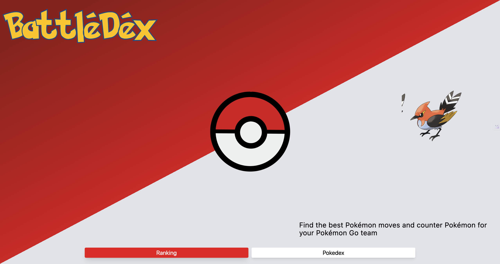

# BattleDex - Your Ultimate Pokémon Go Companion



## Table of Contents

- [Introduction](#introduction)
- [Features](#features)
- [Installation](#installation)
  - [For Windows](#for-windows)
  - [For macOS](#for-macos)
- [Contribution Guidelines](#contribution-guidelines)
- [Contact](#contact)

## Introduction
BattleDex is a comprehensive website dedicated to Pokémon Go players, offering detailed rankings of Pokémon and their perfect movesets according to the League they are playing in. Our goal is to help players optimize their battle strategies and enhance their gaming experience.

## Features

- **Pokémon Rankings**: Access up-to-date rankings for Pokémon in various leagues.
- **Moveset Recommendations**: Find the best movesets for each Pokémon according to the league.
- **User-Friendly Interface**: Enjoy a seamless and intuitive interface designed for easy navigation.
- **Responsive Design**: Access BattleDex on any device, from desktop to mobile.

## Installation

### For Windows

1. Open Command Prompt.
2. Navigate to your project directory:
```
cd path\to\your\project
```
3. Start the Vite development server:
```
npm run dev
```

### For macOS

1. Open Terminal.
2. Navigate to your project directory:
```
cd path/to/your/project
```
3. Start the Vite development server:
```
npm run dev
```

## Contribution Guidelines
Contributions to BattleDex are welcome! To contribute, follow these steps:

1. Fork the repository and clone it to your local machine.
2. Create a new branch for your feature or bug fix:
```
git checkout -b feature-branch
```
3. Make your changes and commit them with descriptive messages.
4. Push your changes to your fork:
```
git push origin feature-branch
```
5. Open a pull request against the main repository's main branch.

## Contact
For inquiries or support, please contact dushyant25609l@gmail.com.
